# Computer-technologies-in-physics

Here are reports on laboratory work for the course "Computer Technologies in Physics" of the Department of Phase Transitions of Perm State National Research University.

To write simulations, analyze and visualize data, the Python 3.9 programming language was used.

## Laboratory works (done :blue_book:)

### laboratory work №1  

**Topic:** Monte Carlo methods. Metropolis algorithm.

**Description:** Comparison and analysis of Monte Carlo methods - trial and error, sample mean, weighted mean.

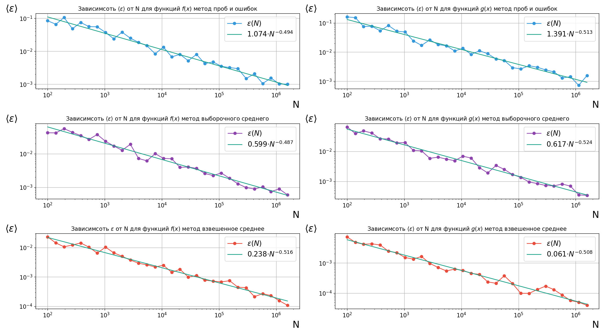

### laboratory work №2 variant 1  

**Topic:** Lattice models of phase transitions.

**Description:** Comparison and analysis of three ways to implement the normal distribution:
- Based on the central limit theorem,
- Box-Muller method,
- Metropolis algorithm;

|                          |                          |
:-------------------------:|:-------------------------:
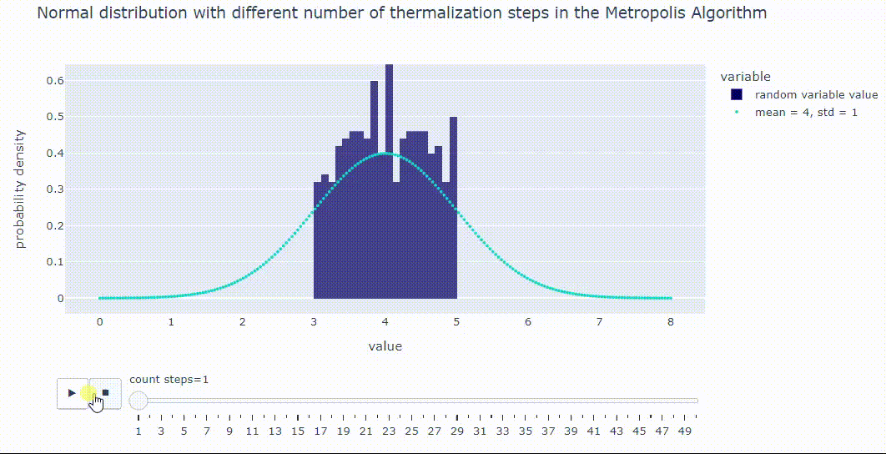    |  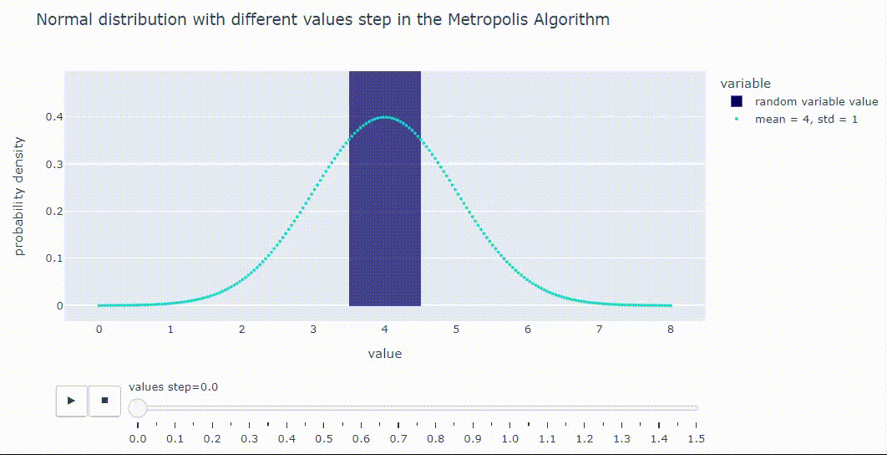   
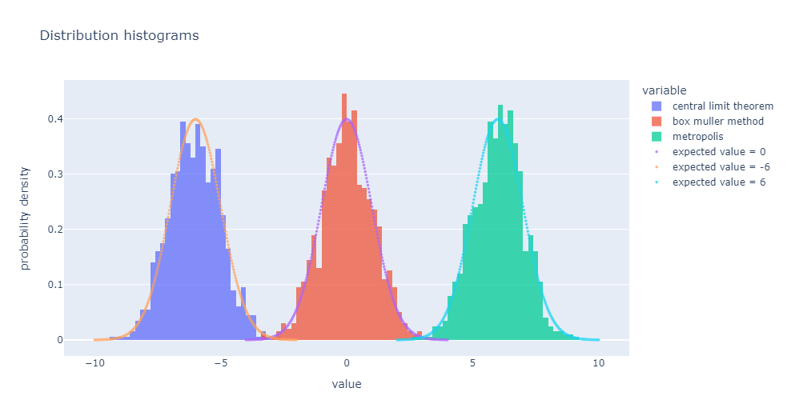    |  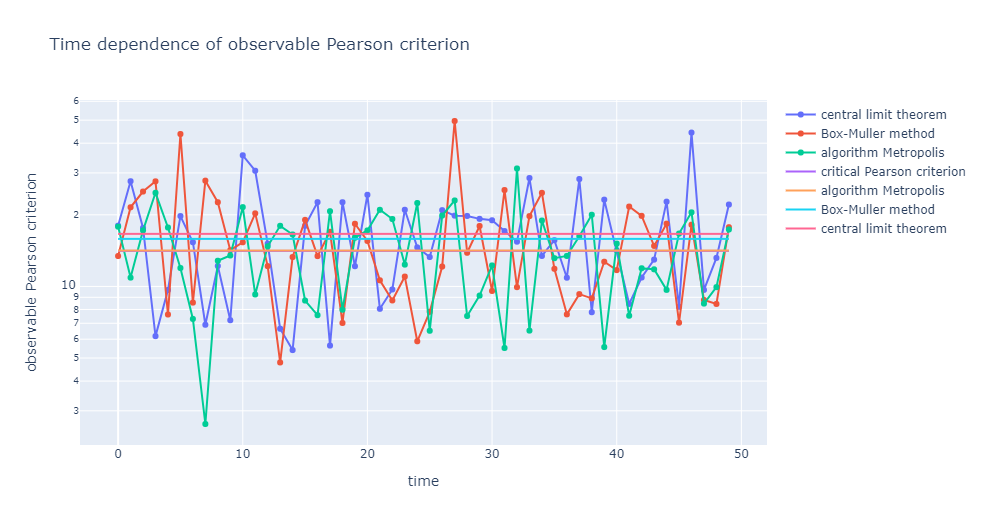   

### laboratory work №3 variant 2 :point_right: 

**Topic:** Simulation of the growth of rough surfaces.

**Description:** Generalization of the model of ballistic particle deposition.

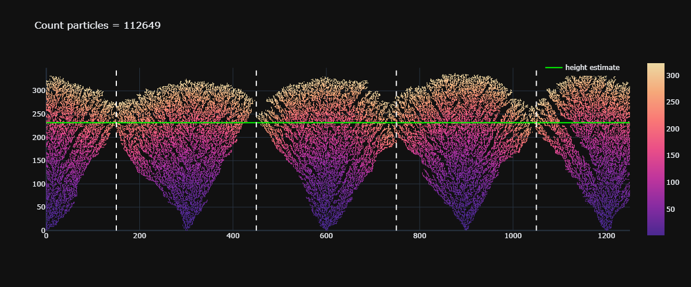 

### laboratory work №4 :point_right: 

**Topic:** Stochastic Growth Models.

### laboratory work №5 :point_right: 

**Topic:** Diffusion Controlled Aggregation.

**Description:**  
- Implementation of an accelerated version of the lattice algorithm for creating a DLA cluster,

- Determination of the fractal dimension of a cluster,

- Simulation of the growth of a DLA cluster on growth centers uniformly distributed on a circle of radius,

- Investigation of the dependence of the number of particles in a cluster on the radius of the circle;

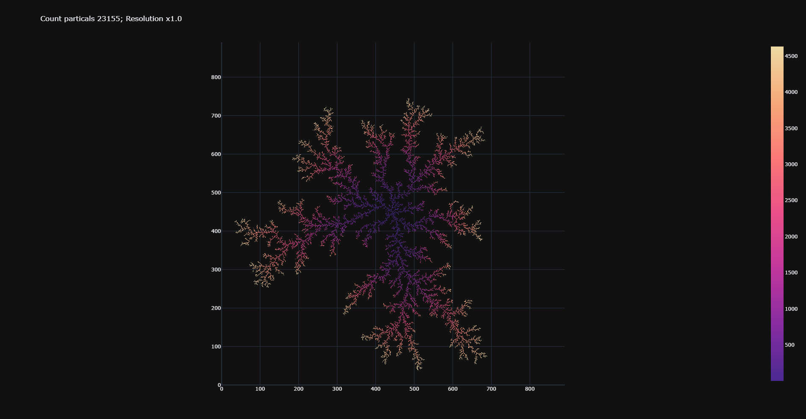 
|                          |                          |
:-------------------------:|:-------------------------:
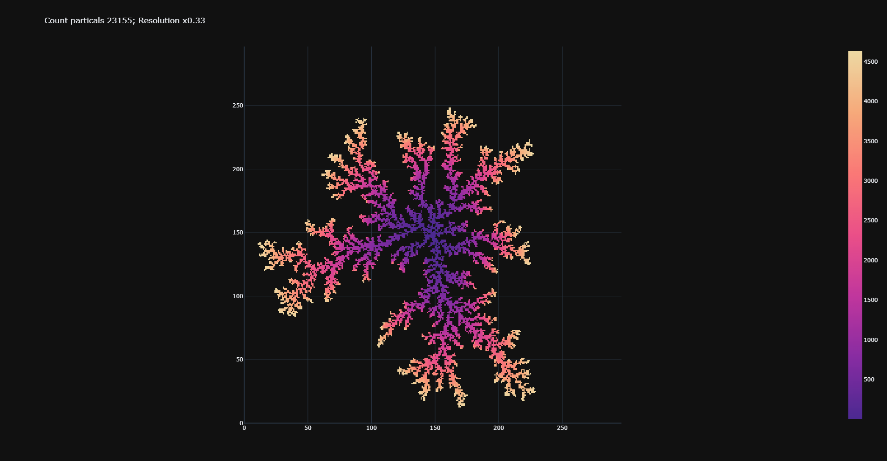     |  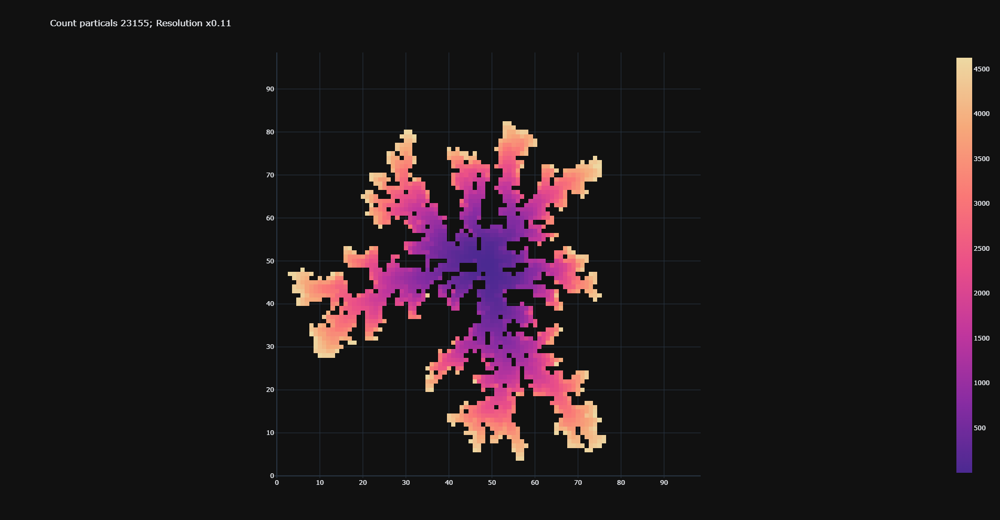 
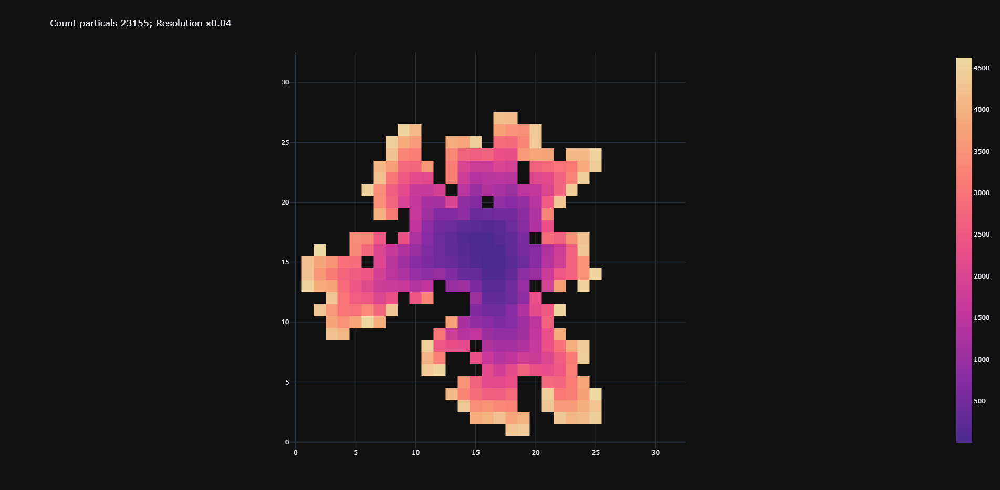     |  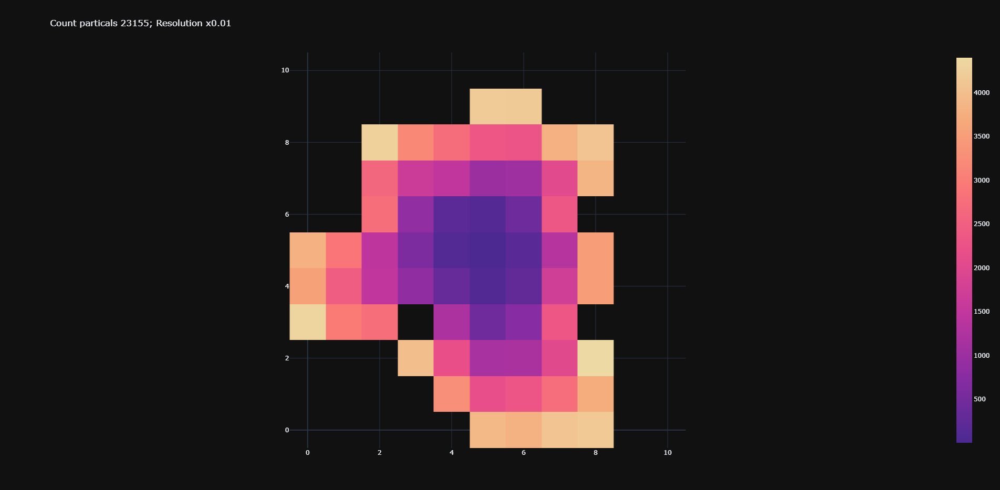 

#### RW laboratory work №1  

This laboratory is related to the topic of Correlation Analysis;

### in progress :writing_hand:
- laboratory work №2 variant 2
- laboratory work №3 variant 1
- RW laboratory work №2 :point_right: 
- RW laboratory work №3 :point_right: 
